import Tabs from '@theme/Tabs';
import TabItem from '@theme/TabItem';

This page will guide you through the initial setup process of setting up your own free-roam AssettoServer on a Windows machine.  
We will be setting up our server in a dedicated folder outside of Content Manager, going over how to configure AI traffic, how to use a few settings to customize the server and learning how to troubleshoot some of the more common causes of server crashes.

## Prerequisites {#prerequisites}

To follow along you will need the following things:

- The **latest** version of AssettoServer.
- The **Shutoko Revival Project** track.
- A `fast_lane.ai(p)` made for **Shutoko Revival Project**.

### Downloading the latest version of AssettoServer {#latest-assettoserver-version}

1. Go to [the latest github release of AssettoServer.](https://github.com/compujuckel/AssettoServer/releases/latest)

2. Click on the `assetto-server-win-x64.zip` in the Assets section of the release to download the file.
   
   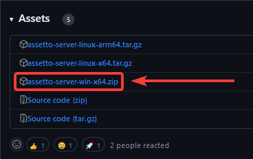

### Downloading the Shutoko Revival Project track and AI spline {#downloading-srp}

:::note
You can use any track that you have a `fast_lane.ai(p)` for.  
In this guide, we will use the SRP track as it is one of the most popular tracks.
:::

1. Go to the [Shutoko Revival Project Website](https://shutokorevivalproject.com/)
2. Download and install the latest **stable** release.

   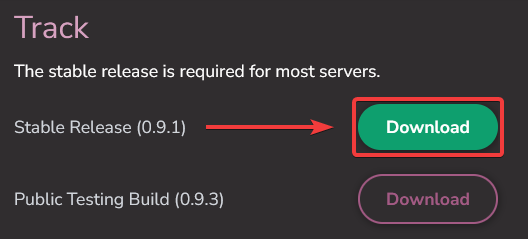

   If you need help with installing the track, please use the [#help channel](https://discord.com/channels/500246817833877505/504100944846520321) on the [Shutoko Revival Project Discord](https://discord.gg/shutokorevivalproject)

3. Join the [AssettoServer Discord](https://discord.gg/uXEXRcSkyz) by clicking on the link in this sentence or the Discord logo in the navbar of this page.  
   
   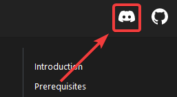

4. Go into the [#ai-spline-releases](https://discord.com/channels/890676433746268231/929390922624532480) channel, open the `Pinned Messages` and download the spline made for Shutoko Revival Project.
   
   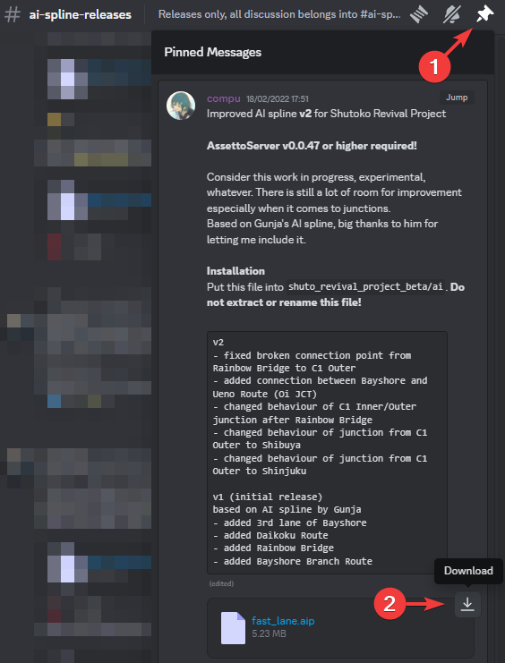

### Extracting AssettoServer and generating essential files {#server-extraction}

1. Extract the `assetto-server-win-x64.zip` into a new folder.

2. Start the server by double-clicking `AssettoServer.exe`.

You might get the following pop up messages from Windows Firewall or Windows Defender:

<Tabs>
<TabItem value="firewall" label="Windows Firewall" default>

   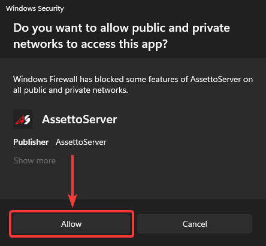

</TabItem>
<TabItem value="defender" label="Windows Defender">

   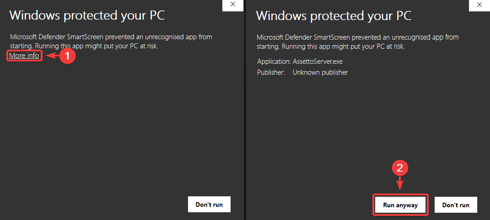

</TabItem>
</Tabs>

After allowing the `AssettoServer.exe` to launch, the server will start, generate all of the files we need for now and then crash.  
This is expected, close the console if it didn't do so automatically.

## Basic Server configuration {#server-configuration}

### Server Name and Track selection {#name-and-track}

1. Navigate to the `cfg` folder of the server and open the `server_cfg.ini`.

2. Change the `NAME=` parameter to your server's name.

3. Change the `TRACK=` and `CONFIG_TRACK=` parameters to the folder name of the track and layout you want to use.

      - Navigate to `\assettocorsa\content\tracks\` in you local game files.
      - Search for the track you want to use and copy the name of the track folder to the `TRACK=` parameter.  
         We will use `shuto_revival_project_beta`.
      - Open the track folder and copy the name of the layout folder you want to use to the `CONFIG_TRACK=` parameter.  
         We will use `overload_layout`.

4. Set a `ADMIN_PASSWORD=` that is at least 8 characters long. 

5. Set `REGISTER_TO_LOBBY=` to `1` if you want the server be visible in the online server list.

6. Save and close the file.

<details>
<summary>Example of how your `server_cfg.ini` should look like:</summary>
<p>

```ini title="server_cfg.ini"
[SERVER]
NAME=AssettoServer Tutorial Server
CONFIG_TRACK=overload_layout
TRACK=shuto_revival_project_beta
SUN_ANGLE=6
PASSWORD=
ADMIN_PASSWORD=SecretPassword123
UDP_PORT=9600
TCP_PORT=9600
HTTP_PORT=8081
CLIENT_SEND_INTERVAL_HZ=20
FUEL_RATE=0
DAMAGE_MULTIPLIER=0
TYRE_WEAR_RATE=0
ALLOWED_TYRES_OUT=-1
ABS_ALLOWED=1
TC_ALLOWED=1
STABILITY_ALLOWED=0
AUTOCLUTCH_ALLOWED=0
TYRE_BLANKETS_ALLOWED=0
FORCE_VIRTUAL_MIRROR=0
REGISTER_TO_LOBBY=1
TIME_OF_DAY_MULT=1
WELCOME_MESSAGE=welcome.txt

[PRACTICE]
INFINITE=1

[DYNAMIC_TRACK]
SESSION_START=95

[WEATHER_0]
GRAPHICS=3_clear_type=15
BASE_TEMPERATURE_AMBIENT=18
BASE_TEMPERATURE_ROAD=24
VARIATION_AMBIENT=2
VARIATION_ROAD=1
WIND_BASE_SPEED_MIN=0
WIND_BASE_SPEED_MAX=0
WIND_BASE_DIRECTION=22
WIND_VARIATION_DIRECTION=0
```

</p>
</details>

### Adding Cars {#adding-cars}

1. Navigate to the `cfg` folder of the server and open the `entry_list.ini`.

2. Copy the existing entries and iterate the `[CAR_X]` until you're happy with the ammount of cars. For this guide we will use 11 cars total.

   :::caution
   Make sure the number of cars you add doesn't exceed the number of pits available for the track and layout you've chosen.  
   You can find the number of pits a track layout has within the tracks content tab in Content Manager.

   For the Shutoko Revival Project - Overload Layout it looks like this:
   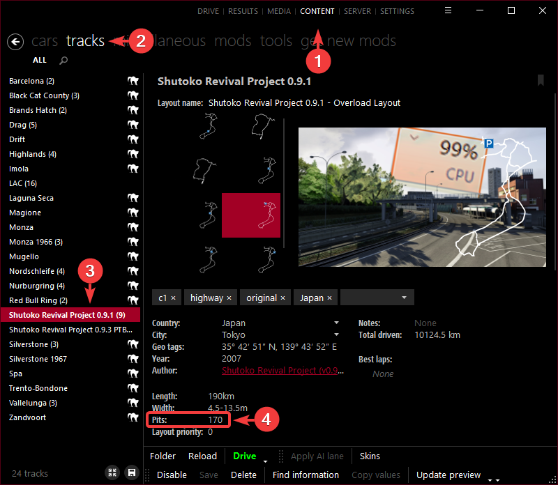

   Adding more cars than available pits will result in the game crashing when trying to join the server.
   :::

3. Change the `MODEL=` and `SKIN=` parameters to the folder name of the cars and skins you want to use.
      - Navigate to the `\assettocorsa\content\cars\` in you local game files.
      - Search for the car you want to use and copy the name of the track folder to the `MODEL=` parameter.  
         We will use the following:  
           - 1x `ruf_yellowbird`  
           - 5x `ks_audi_a1s1`  
           - 5x `ks_toyota_gt86`  
      - Open the car folder and copy the name of the skin folder you want to use to the `SKIN=` parameter.  
         We will use the following:  
           - The `03_black` skin for the `ruf_yellowbird`.  
           - The `00_sepang_blue_pearl_effect_br` skin for the `ks_audi_a1s1`.  
           - The `0_fusion_orange` skin for the `ks_toyota_gt86`.  

:::note
For the SRP overload layout, `[CAR_0]` to `[CAR_39]` will spawn at Tatsumi PA, then at Shibaura PA and so on.  
Keep this in mind when adding more cars than is shown in the guide.
:::

4. Save and close the file.

<details>
<summary>Example of how your `entry_list.ini` should look like:</summary>
<p>

```ini title="entry_list.ini"
[CAR_0]
MODEL=ruf_yellowbird
SKIN=03_black

[CAR_1]
MODEL=ks_audi_a1s1
SKIN=00_sepang_blue_pearl_effect_br

[CAR_2]
MODEL=ks_audi_a1s1
SKIN=00_sepang_blue_pearl_effect_br

[CAR_3]
MODEL=ks_audi_a1s1
SKIN=00_sepang_blue_pearl_effect_br

[CAR_4]
MODEL=ks_audi_a1s1
SKIN=00_sepang_blue_pearl_effect_br

[CAR_5]
MODEL=ks_audi_a1s1
SKIN=00_sepang_blue_pearl_effect_br

[CAR_6]
MODEL=ks_toyota_gt86
SKIN=0_fusion_orange

[CAR_7]
MODEL=ks_toyota_gt86
SKIN=0_fusion_orange

[CAR_8]
MODEL=ks_toyota_gt86
SKIN=0_fusion_orange

[CAR_9]
MODEL=ks_toyota_gt86
SKIN=0_fusion_orange

[CAR_10]
MODEL=ks_toyota_gt86
SKIN=0_fusion_orange
```

</p>
</details>

### Adding Checksums {#adding-checksums}

1. Navigate to the main folder of the server and create a folder called `content`.

2. Inside the `content` folder create two folders called `tracks` and `cars`.

   <Tabs>
   <TabItem value="tracksum" label="Track Checksum" default>

      - Inside the `tracks` folder, create afolder called `shuto_revival_project_beta` and inside of that folder create a folder called `overload_layout`.

      - Navigate to `\assettocorsa\content\tracks\shuto_revival_project_beta` in your local game files.

      - Copy the `models_overload_layout.ini` to the `content\tracks\shuto_revival_project_beta` folder of the server.
      
      - Navigate to `\assettocorsa\content\tracks\shuto_revival_project_beta\overload_layout\data` in your local game files.
      
      - Copy the `surfaces.ini` to the `content\tracks\shuto_revival_project_beta\overload_layout` folder of the server.

   </TabItem>
   <TabItem value="carsum" label="Car Checksum">

      - Inside the `car` folder, create a folder for each car.  
      We will have to create the following folders: `ruf_yellowbird`, `ks_audi_a1s1`, `ks_toyota_gt86`.

      - Navigate to `\assettocorsa\content\cars\` in your local game files.
      
      - Open the folder of each car and copy the `data.acd` to their respective `content\cars\` folders of the server.

   </TabItem>
   </Tabs>

<details>
<summary>Example of how your server `content` folder should look like:</summary>
<p>

   ```
   ├─ 📁content
   │  ├─ 📁cars
   │  │  ├─ 📁ks_audi_a1s1
   │  │  │  ├─ 📄data.acd
   │  │  ├─ 📁ks_toyota_gt86
   │  │  │  ├─ 📄data.acd
   │  │  ├─ 📁ruf_yellowbird
   │  │  │  ├─ 📄data.acd
   │  ├─ 📁tracks
   │  │  ├─ 📁shuto_revival_project_beta
   │  │  │  ├─ 📁overload_layout
   │  │  │  │  ├─ 📄surfaces.ini
   │  │  │  ├─ 📄models_overload_layout.ini
   ```

</p>
</details>

   :::caution
      If the checksum file for cars are missing from your local game files, you will have to either pack the car data yourself using Content Manager or ignore this warning by setting the following parameter in `extra_cfg.yml` to `true`:
      ```yml title="extra_cfg.yml"
      IgnoreConfigurationErrors:
      MissingCarChecksums: true
      ```
      Keep in mind that the checksums are required to prevent people from cheating by modifying their car and track data.  
      Ignore this warning at your own risk.  
   :::

### Enabling Traffic {#traffic-basics}

1. Navigate to the `cfg` folder inside the server's main folder.

2. Open the `extra_cfg.yml` using a text editor of your choice and set `EnableAi: true`.  

   ```yaml title="extra_cfg.yml"
   # Enable AI traffic
   EnableAi: true
   ```

3. Save and close the file, then open the `entry_list.ini`.  
   For the first car, which will be the RUF that we want to drive, we will add the following line below `SKIN=`.

   ```ini title="entry_list.ini"
   [CAR_0]
   MODEL=ruf_yellowbird
   SKIN=03_black
   AI=none
   ```

   For the remaining cars we will add the line `AI=fixed` instead.

4. After saving and closing the file, navigate to the content folder of the track, which is `\content\tracks\shuto_revival_project_beta`. Create a new folder called `ai` and place the `fast_lane.aip` we downloaded earlier inside of it.
   
   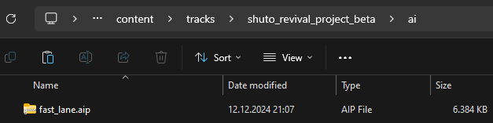

5. Now go back into the main folder of the server and launch `AssettoServer.exe`.  
   If you did everything correctly you should see something along the lines of this:

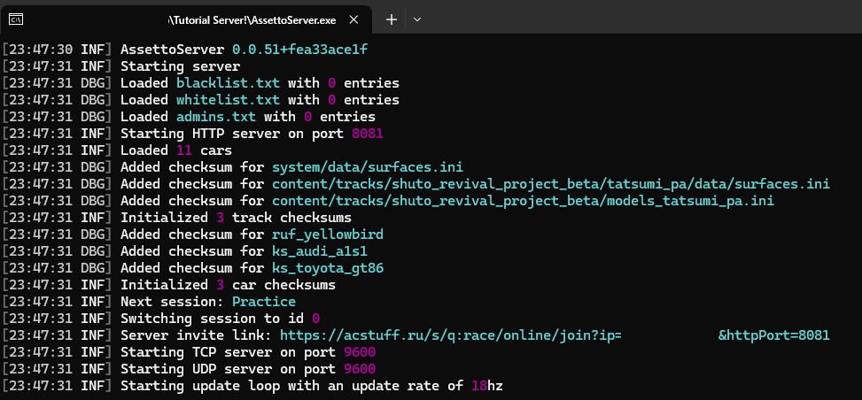

   :::caution
   You might also have the following error message inside of your log:  
      ```
      Your ports are not forwarded correctly. The server will continue to run, but players outside of your network won't be able to join.
      To fix this, you'll need to go into your router settings and create Port Forwards for these ports:
      Port 9600 UDP
      Port 9600 TCP
      Port 8081 TCP
      Local IP: XXX.XXX.XXX.XXX
      Router Page: http://XXX.XXX.XXX.X/
      Since Instructions are different for each router, search in Google for "how to port forward" with the name of your router and/or ISP.
      ```

   This means that you need to forward the ports that AssettoServer uses inside your router and possibly make a exception for the `AssettoServer.exe` inside your firewall.  

   Because Instructions are different for each router / ISP, we will not explain how to do this here.  
   Refer to the user manual of your router or search in Google for "how to port forward" with the name of your router and/or ISP.
   :::

   Then open Content Manager and go to the `Drive` tab, select the `Online` tab and then the `LAN` tab.  
   The server will now appear in the server list. It may take a few moments, so you might need to refresh the list a few times.
   
   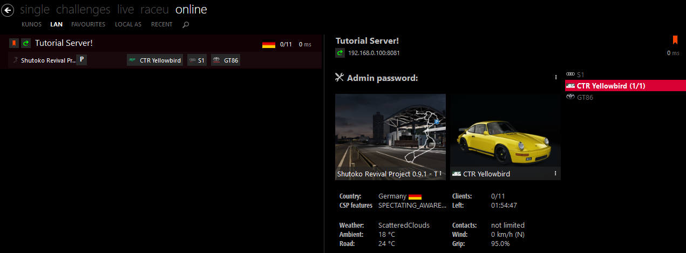

6. Select the RUF, click `Join` and drive out of the pits to start spawning AI traffic.

7. Other people will also be able to join the server by searching for it or via the invite link that you can copy from the console.
   
   :::caution
   Do not click the Invite button to copy the invite link, it will copy your local IP which is useless to people outside of your local network. Use the link that is generated in the console instead.
   :::

## Advanced Server Configuration {#advanced-server-config}

### Time and Date {#changing-time-date}

1. Navigate to the `cfg` folder of the server and open the `server_cfg.ini` with a text editor of your choice.

2. Find the `GRAPHICS=` parameter in the `[WEATHER_0]` section, it should look something like this:

   ```ini title="server_cfg.ini"
   [WEATHER_0]
   GRAPHICS=3_clear_type=15_time=0_mult=0
   BASE_TEMPERATURE_AMBIENT=18
   BASE_TEMPERATURE_ROAD=6
   VARIATION_AMBIENT=2
   VARIATION_ROAD=1
   WIND_BASE_SPEED_MIN=0
   WIND_BASE_SPEED_MAX=0
   WIND_BASE_DIRECTION=22
   WIND_VARIATION_DIRECTION=0
   ```
   - To change the Time, change the number after `_time=` to the time you want in seconds from 00:00.  
      For example to set the time to `18:00` you would do `_time=64800`.

   - To change the Time Multiplier, change the number after `_mult=`.  
      `_mult=1` would result in time progressing as fast as in real life, `_mult=2` would be twice as fast etc.  

   - To change the Date you'll need to do two things:
      - Change the number after `_start=` to the date you want in Epoch time.  
         Use a site like [epochconverter](https://www.epochconverter.com/) to get the Epoch time that you want.  
         For example: `_start=1719700000` would result in the date being June 30th, 2024.
      - Open `extra_cfg.yml` and set `LockServerDate` to `false`  

         ```yml title="extra_cfg.yml"
            # Lock server date to real date. This stops server time "running away" when using a high time multiplier, so that in-game sunrise/sunset times are based on the current date
            LockServerDate: false
         ```
3. After making these adjustments it should look something like this:

   ```ini title="server_cfg.ini"
   [WEATHER_0]
   GRAPHICS=3_clear_type=15_time=64800_mult=0_start=1719700000
   BASE_TEMPERATURE_AMBIENT=18
   BASE_TEMPERATURE_ROAD=6
   VARIATION_AMBIENT=2
   VARIATION_ROAD=1
   WIND_BASE_SPEED_MIN=0
   WIND_BASE_SPEED_MAX=0
   WIND_BASE_DIRECTION=22
   WIND_VARIATION_DIRECTION=0
   ```
   With these settings the server will start at 18:00 on the 30 June 2024 and the time will not progress.

### Weather {#changing-weather}
 
:::caution
All players will need to have a Custom Shaders Patch preview version installed to see rain.  
Rain does not come with Sol or Pure. Rain is part of the paid preview versions of Custom Shaders Patch.  
Purchase Custom Shaders Patch previews on [x4fabs Patreon](https://www.patreon.com/user?u=11605034).
:::

1. Navigate to the `cfg` folder of the server and open the `server_cfg.ini` with a text editor of your choice.

2. Find the `[WEATHER_0]` section, it should look something like this:

   ```ini title="server_cfg.ini"
   [WEATHER_0]
   GRAPHICS=3_clear_type=15_time=0_mult=0
   BASE_TEMPERATURE_AMBIENT=18
   BASE_TEMPERATURE_ROAD=6
   VARIATION_AMBIENT=2
   VARIATION_ROAD=1
   WIND_BASE_SPEED_MIN=0
   WIND_BASE_SPEED_MAX=0
   WIND_BASE_DIRECTION=22
   WIND_VARIATION_DIRECTION=0
   ```

3. Under `[WEATHER_0]` find the parameter `GRAPHICS=` and change the WeatherFX ID after `_type=` to the ID of the weather you want.  
   If you're unsure which ID to use, please check the [list of available WeatherFX type IDs](./misc/wfx-types.md).  
   For example, to change the starting weather to be `Heavy Rain` instead of `Clear`, it would look like this:

   ```ini title="server_cfg.ini"
   [WEATHER_0]
   GRAPHICS=3_clear_type=8_time=0_mult=0
   ...
   ```

   If you just want Rain graphics without the physics you can add the following to your `csp_extra_options.ini`
   ```ini title="csp_extra_options.ini"
   [EXTRA_RULES] 
   DISABLE_RAIN_PHYSICS=1
   ```

4. Save and restart the server to apply the changes.

### CSP Extra Server Options {#csp-server-options}

If we want to take advantage of some of the features that CSP provides for servers, we will need to create a file inside our `cfg` folder and configure a few things.

#### Requiring a minimum CSP Version {#requiring-csp-version}

AssettoServer requires CSP version 0.1.77 (1937) by default.  
To change this edit `MinimumCSPVersion: 1937` in the `extra_cfg.yml`.  
If you want to require a different CSP version and don't know how where to get the ID from, read the [FAQ section](./faq.md#csp-version-ids) that explains it.

Navigate to the `cfg` folder of the server and create a file called `csp_extra_options.ini`.
The [CSP Wiki](https://github.com/ac-custom-shaders-patch/acc-extension-config/wiki/Misc-%E2%80%93-Server-extra-options) has a long list of options and settings you can play around with.  
Two of the more useful options for Freeroam servers are listed below.

```ini title="csp_extra_options.ini"
 [EXTRA_RULES]
 ALLOW_WRONG_WAY = 1   ; Allow cars to drive either way, gets rid of the wrong way sign on some tracks

 [PITS_SPEED_LIMITER]
 DISABLE_FORCED = 0    ; Disable forced pits speed limiter
 KEEP_COLLISIONS = 0   ; Activate collisions between cars in pits
 SPEED_KMH = 120       ; Alter pits speed limiter value; default is 80
```

#### Extra steps for teleportation and color changing {#csp-extra-steps}

For teleportation and color changing there are additional steps for us.

1. Navigate to the `cfg` folder and open the `entry_list.ini`.

2. Each car has a `SKIN=` line that needs to be edited to allow that car to use these features.  
   The following codes need to be added to the skin line:

   | Code    | Usage                                   |
   | ------- | --------------------------------------- |
   | `/ACA3` | Allow Teleporting                       |
   | `/ABAH` | Allow Color Changing                    |
   | `/ADAn` | Allow both Color Changing & Teleporting |

   This is **NOT** a full list of all codes and options available, just some of the most frequently used ones.

   Meaning, if we wanted to use teleportation and color changing it would look like this:

   ```ini title="entry_list.ini"
   [CAR_0]
   MODEL=ruf_yellowbird
   SKIN=03_black/ADAn
   ```

   If we wanted to also allow our AI cars to spawn in different colors, we would have to at least add `/ABAH` to each of the car's skin lines since we don't care about teleportation for them.

3. Now we are ready to add options to our `csp_extra_options.ini` file.

   So, with color changing and teleportation the file looks like this:

   ```ini title="csp_extra_options.ini"
   [EXTRA_RULES]
   ALLOW_WRONG_WAY = 1   ; Allow cars to drive either way, gets rid of the wrong way sign on some tracks

   [PITS_SPEED_LIMITER]
   DISABLE_FORCED = 0    ; Disable forced pits speed limiter
   KEEP_COLLISIONS = 0   ; Activate collisions between cars in pits
   SPEED_KMH = 120       ; Alter pits speed limiter value; default is 80

   [CUSTOM_COLOR]
   ALLOW_EVERYWHERE = 1   ; change car colors anywhere as long as the car is stopped.

   [TELEPORT_DESTINATIONS]
   POINT_1 = Position 1
   POINT_1_GROUP = Shibaura PA
   ...
   ```

   You can find the teleports used on the Official Shutoko Revival Projects servers in this [FAQ Section](./faq.md#srp-teleports)

4. Save and close the file and restart the server, you're able to teleport / change your car color via the lightbulb in the chat app and will have traffic that is randomly colored.  
   
   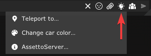

### AssettoServer Plugins {#enabling-plugins}

AssettoServer comes with a few free to use plugins, we'll look at how to enable and configure two:  
The [AutoModerationPlugin](./plugins/AutoModerationPlugin.md) and the [RandomWeatherPlugin](./plugins/RandomWeatherPlugin.md).  
You can add as many or as few as you want, just make sure to carefully read the [documentation pages](./category/plugins) as some plugins might require certain things or won't work together.  
You can enabled and configured several plugins at once to cut down on the number of times you need to restart the server.  
However setting them up one by one like we will, makes it easier to find issues if something goes wrong.  

:::caution
When editing plugin configurations, be careful to keep the format from the documentation. The indentation of each line matters, and the server will crash if it is wrong.
:::

#### AutoModerationPlugin

1. Navigate to the `cfg` folder of the server and open the `extra_cfg.yml`.

2. Find `EnablePlugins:` and enable the plugin like so:
   ```yaml title="extra_cfg.yml"
   # List of plugins to enable
   EnablePlugins:
     - AutoModerationPlugin
   ```
3. Save the file, double-click `AssettoServer.exe` to launch the server and generate the plugin config, then close the console and return to the `cfg` folder.

4. Open the `plugin_auto_moderation_cfg.yml` and `Enabled: true` the featues you want and save the file.
   It should look something like this: 
   ```yml title="plugin_auto_moderation_cfg.yml"
   # yaml-language-server: $schema=schemas\plugin_auto_moderation_cfg.schema.json
   
   # Kick players that are AFK
   AfkPenalty:
     # Set to true to enable
     Enabled: true
     # Don't kick if at least one open slot of the same car model is available
     IgnoreWithOpenSlots: true
     # Time after the player gets kicked. A warning will be sent in chat one minute before this time
     DurationMinutes: 10
     # Set this to MinimumSpeed to not reset the AFK timer on chat messages / controller inputs and require players to actually drive
     Behavior: PlayerInput
   # Kick players with a high ping
   HighPingPenalty:
     # Set to true to enable
     Enabled: true
     # Time after the player gets kicked. A warning will be sent in chat after half this time
     DurationSeconds: 20
     # Players having a lower ping will not be kicked
     MaximumPingMilliseconds: 500
   # Penalise players driving the wrong way. AI has to enabled for this to work
   WrongWayPenalty:
     # Set to true to enable
     Enabled: true
     # Time after the player gets kicked. A warning will be sent in chat after half this time
     DurationSeconds: 20
     # Players driving slower than this speed will not be kicked
     MinimumSpeedKph: 20
     # The amount of times a player will be send to pits before being kicked
     PitsBeforeKick: 2
   # Penalise players driving without lights during the night
   NoLightsPenalty:
     # Set to true to enable
     Enabled: true
     # Time in which no warning or signs will be sent
     IgnoreSeconds: 2
     # Time after the player gets kicked. A warning will be sent in chat after half this time
     DurationSeconds: 60
     # Players driving slower than this speed will not be kicked
     MinimumSpeedKph: 20
     # The amount of times a player will be send to pits before being kicked
     PitsBeforeKick: 2
   # Penalise players blocking the road. AI has to be enabled for this to work
   BlockingRoadPenalty:
     # Set to true to enable
     Enabled: true
     # Time after the player gets kicked. A warning will be sent in chat after half this time
     DurationSeconds: 30
     # Players driving faster than this speed will not be kicked
     MaximumSpeedKph: 5
     # The amount of times a player will be send to pits before being kicked
     PitsBeforeKick: 2
   ```
   If we wanted to, we could now further adjust the plugin config, we will be leaving it as is for now.

#### RandomWeatherPlugin

1. Navigate to the `cfg` folder of the server and open the `extra_cfg.yml`.

2. Find `EnablePlugins:` and enable the plugin like so:
   ```yaml title="extra_cfg.yml"
   # List of plugins to enable
   EnablePlugins:
     - AutoModerationPlugin
     - RandomWeatherPlugin
   ```
3. Save the file, double-click `AssettoServer.exe` to launch the server and generate the plugin config, then close the console and return to the `cfg` folder.

4. Open the `plugin_random_weather_cfg.yml`. We will edit the `WeatherWeights` to only allow for `Clear`, `FewClouds`, `ScatteredClouds`, `BrokenClouds` and `OvercastClouds` like so:
   ```yaml title="plugin_random_weather_cfg.yml"
   # yaml-language-server: $schema=schemas\plugin_random_weather_cfg.schema.json

   # Weights for random weather selection, setting a weight to 0 blacklists a weather, default weight is 1
   WeatherWeights:
     LightThunderstorm: 0
     Thunderstorm: 0
     HeavyThunderstorm: 0
     LightDrizzle: 0
     Drizzle: 0
     HeavyDrizzle: 0
     LightRain: 0
     Rain: 0
     HeavyRain: 0
     LightSnow: 0
     Snow: 0
     HeavySnow: 0
     LightSleet: 0
     Sleet: 0
     HeavySleet: 0
     Clear: 1
     FewClouds: 1
     ScatteredClouds: 1
     BrokenClouds: 1
     OvercastClouds: 1
     Fog: 0
     Mist: 0
     Smoke: 0
     Haze: 0
     Sand: 0
     Dust: 0
     Squalls: 0
     Tornado: 0
     Hurricane: 0
     Cold: 0
     Hot: 0
     Windy: 0
     Hail: 0
   # Minimum duration until next weather change
   MinWeatherDurationMinutes: 5
   # Maximum duration until next weather change
   MaxWeatherDurationMinutes: 30
   # Minimum weather transition duration
   MinTransitionDurationSeconds: 120
   # Maximum weather transition duration
   MaxTransitionDurationSeconds: 600
   ```
5. Save and close the file and restart the server.  

If you did everything correctly you will see two new lines at the beginning of the server log:  

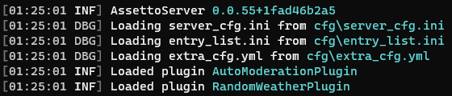  

This covers how to enable and configure plugins.  

## Troubleshooting Basics {#troubleshooting}

If at some point something goes wrong and the server no longer starts properly, there a few way to figure out what went wrong and how to fix it.
We will be looking at one of the more common reasons for a server crash in this example but learning what to look for can help you figure out how to fix any problem.

:::note
If the console window just closes when you try to start the server there will always be a server logfile in the `logs` folder and a crash logfile in the `crash` folder that you can read!  
:::

Server logs will be generated in the `logs` folder of the server.
They will be generated as `log-20230706.txt` with the part after `log-` being the date the log was written.

Before I continue I want to explain a few thing that can be useful to cut down on how much you have to read in order to understand.  
Each line in the log will have some information in the beginning: `YEAR-MONTH-DAY HR:MIN:SEC.MILS TIMEZONE(+/- UTC) [TYPE]`  
We only really care about the type and actual message, so here is a little cheatsheet:

| Message Type    | Meaning                                                                             |
| --------------- | ----------------------------------------------------------------------------------- |
| `[DBG]`         | Debug, can be ignored                                                               |
| `[INF]`         | Information, can also be ignored                                                    |
| `[WRN]`         | Warning, might be important but can usually be ignored as well                      |
| `[ERR]`         | Error, an error the server can recover from and keep running.                       |
| `[FTL]`         | Fatal, an error causing the server to terminate.                                    |

While `[INF]`, `[DBG]` and `[WRN]` might have hints for other problems, in our example we will focus on the `[ERR]` and `[FTL]` messages.

#### Example #1 - Missing AI spline {#missing-aispline}

Now, I want you to look at the log in the image below and try to read the log until you find something that might give you a idea about what is causing the server to crash.  

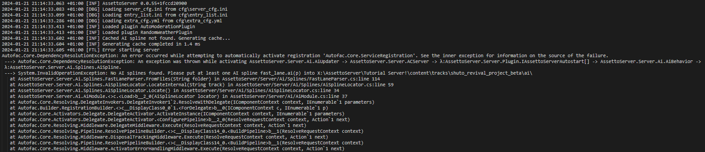

At first this might seem like a lot of scary text and that doesn't really change even if we narrow it down the the `[FTL]` message.  
But if we actually try and read a few lines we can spot something we will be able to understand:  

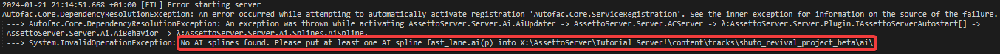

This line tells us everything we need to know, so we can ignore the rest of the message.

`No ai folder found. Please put at least one AI spline fast_lane.ai(p) into \content\tracks\shuto_revival_project_beta\ai\`

Apparently we failed to place a AI spline in the correct folder.  
Moving the `fast_lane.aip` into the folder that is shown in the log message (or creating the folder if needed), will get rid of this error and should let the server start without problems.

#### Example #2 - Syntax error in config file {#syntax-errors}

Since we enabled and configured some plugins earlier on, let's look at an example that has something to do with that.  

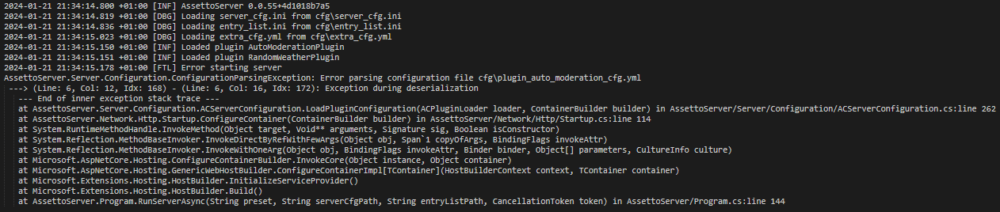

While this looks a lot different and it doesn't provide a helpful message telling us what to do as before, it is actually easy to understand.
`Error parsing configuration file cfg\plugin_auto_moderation_cfg.yml --> (Line: 6, Col: 16, Idx: 172)`  
From this line we can tell that something went wrong parsing the `plugin_auto_moderation_cfg.yml` file.  
So lets open the `plugin_auto_moderation_cfg.yml` and take a look at Line `6`

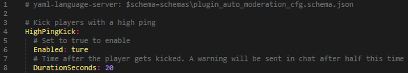

At first glance, especially if you don't use a text editor that has syntax highlighting, it might look like there is nothing wrong here.  
But looking closer, we can see that we made a typo when enabling `HighPingKick`, correcting the `Enabled: ture` to `Enabled: true` and saving the file will get rid of this error and should let the server start without problems.  

## Updating the Server {#updating-the-server}

In general, it is recommended to start fresh instead of simply overwriting files when updating AssettoServer.  

1. Backup your current server files and download the [latest release](#latest-assettoserver-version). (or the version you want to update to)

2. Create a new folder for the updated server and extract the new AssettoServer files as explained [back in this section](#server-extraction).

3. From your old server, only copy and re-use files that are not `extra_cfg.yml` or `plugin_<plugin_name>_config.yml`.

4. Run the updated `AssettoServer.exe` once to generate a updated `extra_cfg.yml`.

5. Use the backup of your old `extra_cfg.yml` to reconfigure the `extra_cfg.yml` of the updated server.

6. If you had any plugins enabled, restart the updated server once to generate new plugin config files and then reconfigure them.

:::note
The parameters inside `extra_cfg.yml` and plugin config files may change between versions.  
If you overwrite the file with one from a older version or change / restore parameters manually, the server may stop working.
:::

## How to Ask for Help {#asking-for-help}

If you have a question or run into a problem that you can't figure out yourself, feel free to join the AssettoServer Discord and ask for help.  
Before that though, please make sure to read the [Introduction](./intro.mdx), [FAQ](./faq.md) and [Common configuration errors](./common-configuration-errors.md) pages as they answer a lot of common questions.

:::caution
If you need help with setting up your server please use #server-troubleshooting.  
Posting your problem in #bug-reports or #general will ususally result in the message being ignored or deleted.
:::

### Help Us Help You {#help-us-help-you}

#### Use the Search function.

  It's more than likely that whatever problem you're having, someone else did too and already asked how to fix it.  
  While Discords search is not known for being good, it should still give you something you can read through to see if your problem can be resolved the same way.  

  Pressing `CTRL + F` while in the [#server-troubleshooting](https://discord.com/channels/890676433746268231/921759366183534622) channel will narrow down results to only this channel.  
  After that type in something short, like the beginning sentence of a error message for example.  
  Then look over the results and see if anything matches what you are looking for.  
  If you found a message you want to take a closer look at, hover over the message and click on the `Jump` button.  

  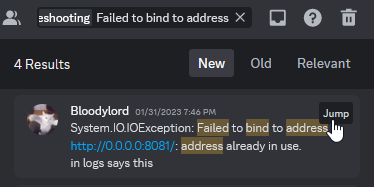  

  You will be moved to when the message was sent so you can read over the full chat history.  
  If there are no results, or if nothing mentioned in the conversations helped to fix your problem, you can also try jumping to another message or removing the `in:#server-troubleshooting` to search the entire Discord.  
  If all of that is unsuccessful you can then move on to formulating your own message.

#### Don't ask to ask. 
   > Hey, anyone here that can help me?

   These messages usually result in nobody responding to them because it can also be read as:
   > I have a question but I'm too lazy to actually formalize it into words unless there's someone in the channel who wants to spend time answering it.

    The solution is not to ask to ask, but just to ask. Someone who is idling in the channel and only every now and then glances at what's going on is unlikely to answer to your "asking to ask" question, but if you actually describe your problem it may get them to respond because you (hopefully) already provided all the information they needed to help you.

#### Provide as much information as you can, and format it so that it is easily readable.
   > Server crashing, help what do?

   This is just as bad as asking to ask because it requires people to ask you for more details in order to narrow down the problem.  
   Try explaning the problem and what you have already tried to fix the problem.  
   Include the server crash log by uploading the `crash_XXXXXXXX_XXXXXX.txt` from the `crash` folder of the server.  
   Screenshots of files can leave out important information and are generally harder to read.  
   If you just want to copy a few lines, use Discord's markdown feature to put it into a codeblock for easier readablitiy.  
   This can be done by surrounding it with ` ``` ` like this: ` ```Text``` `
   
   Some example messages that are easy to read:
   
   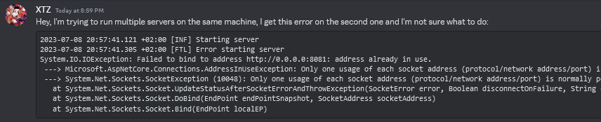
   
   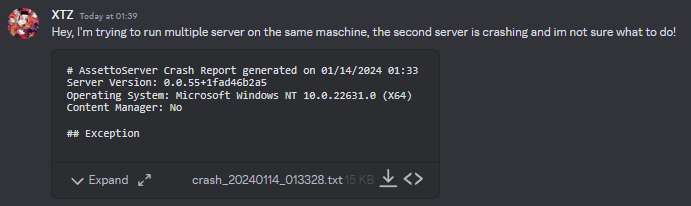
